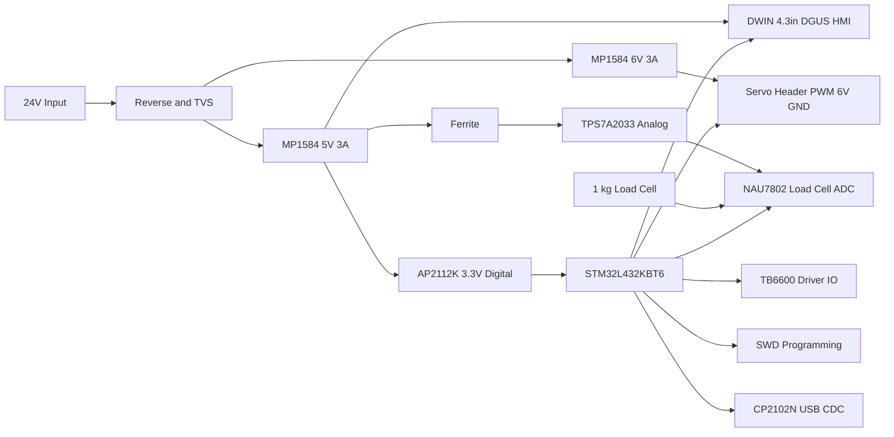
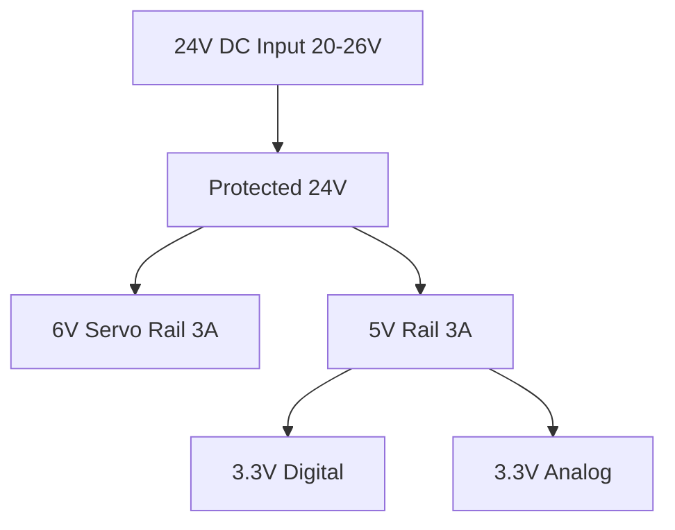

# Flexural Testing Machine — Control PCB

**Main control board for a catheter flexural/kink test rig with motion control, load-cell acquisition, and DWIN HMI.**

> **Open-hardware control PCB that advances a catheter via stepper, applies a defined bend angle via servo, and measures force with a 1 kg load cell to detect kink onset.**

---

[](LICENSE)
[](outputs/fab/flexural-pcb_rev1.0_fab.zip)
[](docs/changelog.md)
[](README.md)
[](hardware/altium/)

---

## Quick Links

- [Schematic PDF](hardware/altium/flexural-pcb_rev1.0_sch.pdf)
- [PCB Layout](hardware/altium/flexural-pcb_rev1.0_pcb.pdf)
- [Fabrication Bundle](outputs/fab/flexural-pcb_rev1.0_fab.zip)
- [Assembly Bundle](outputs/assy/flexural-pcb_rev1.0_assy.zip)
- [Issues](../../issues)
- [Discussions](../../discussions)

---

## Table of Contents

1. [Overview](#overview)
2. [Safety & Regulatory Notice](#safety--regulatory-notice)
3. [Highlights / Features](#highlights--features)
4. [System / Block Diagram](#system--block-diagram)
5. [Power Architecture](#power-architecture)
6. [Schematic Overview](#schematic-overview)
7. [Connectors & Pinouts](#connectors--pinouts)
8. [Bill of Materials (BOM)](#bill-of-materials-bom)
9. [PCB Stackup & Rules](#pcb-stackup--rules)
10. [Layout Notes & 3D/Mechanical](#layout-notes--3dmechanical)
11. [EDA Tooling & Directory Structure](#eda-tooling--directory-structure)
12. [Design Rules & Constraints](#design-rules--constraints)
13. [Manufacturing: Fabrication Outputs](#manufacturing-fabrication-outputs)
14. [Manufacturing: Assembly Outputs](#manufacturing-assembly-outputs)
15. [DFM / DFT Guidance](#dfm--dft-guidance)
16. [Programming & Interfaces](#programming--interfaces)
17. [Calibration & Bring-Up](#calibration--bring-up)
18. [Validation & Test Records](#validation--test-records)
19. [Known Issues / Errata](#known-issues--errata)
20. [Roadmap](#roadmap)
21. [Contributing](#contributing)
23. [License](#license)
24. [Acknowledgments & Citation](#acknowledgments--citation)
25. [Changelog](#changelog)

---

## Overview

The **Flexural Testing Machine — Control PCB** is the main controller for a bench-top R&D device designed to measure the force at which catheters begin to kink under controlled bending. The PCB orchestrates the workflow: advancing the catheter, bending to a preset angle, acquiring force data, detecting kink onset, graphing/logging results, and reporting. Not intended for clinical or patient use.

**Workflow Summary:**
1. Advance catheter via stepper motor.
2. Bend catheter to defined angle using servo.
3. Acquire force via load cell and NAU7802 AFE.
4. Detect kink onset (force spike/drop).
5. Display/log results via DWIN HMI and USB.
6. Stop and report.

---

## Safety & Regulatory Notice

> ⚠️ **For R&D bench testing only; NOT a clinical device.**
>
> - Observe electrical safety protocols.
> - Beware of pinch hazards and motorized motion.
> - No claim of compliance with IEC/ISO standards.
> - References to standards are for design context only.

---

## Highlights / Features

- **MCU:** STM32L432KBT6 (Cortex-M4F, 80 MHz, 256 KB Flash, 64 KB SRAM, LQFP-32)
- **HMI:** DWIN 4.3″ DGUS II TFT Touch (DMT48270T043, UART-TTL, 5 V)
- **Stepper Driver:** TB6600 external module (optocoupled, 24 V)
- **Servo Output:** PWM 50 Hz, 1–2 ms, 6 V rail
- **Force Sensor:** 1 kg 4-wire load cell (1.0–2.0 mV/V)
- **Load-Cell ADC/AFE:** NAU7802CGI (24-bit Δ-Σ, I²C, 3.3 V)
- **Power Input:** 24 V DC (20–26 V), reverse/surge protected
- **Regulators:** MP1584EN (24 V→6 V/5 V, 3 A), AP2112K-3.3 (600 mA), TPS7A2033PDBVR (300 mA, low-noise)
- **Level Shifting/Protection:** 74AHCT125N, SN74LVC2T45DCUR, TPD4E1U06DQAR
- **PC Interface:** CP2102N USB-UART, Micro-B
- **Programming:** 10-pin 1.27 mm Cortex-M SWD header
- **Clocks:** 32.768 kHz LSE, 8 MHz HSE (fitted)
- **Discrete IO:** Limit/Home switches (x2), E-Stop (ISO1212D, 24 V)
- **Connectors:** Phoenix MCV 5.08, JST-XH, Molex Micro-B
- **Protections/Filters:** MBRS340, TVS diodes, ferrite beads, bulk caps
- **Decoupling:** 100 nF + 4.7 µF per device, anti-aliasing RC
- **Form Factor:** 120 × 90 mm, 4× M3 mounting holes, 3 mm keep-outs

---

## System / Block Diagram



---

## Power Architecture



---

## Schematic Overview

- **Pages:**
	- MCU Core & Clocks
	- Power & Regulation
	- TB6600 Stepper IO
	- Servo Output
	- Load Cell & NAU7802 AFE
	- DWIN HMI UART
	- USB/CP2102N
	- SWD Programming
	- E-Stop & Limit Switches
- **Key Circuits:**
	- Reset: NRST RC (10 kΩ/100 nF)
	- BOOT0: 10 kΩ pulldown
	- Decoupling: 100 nF at each VDD, 4.7 µF bulk per IC
	- Anti-aliasing: 1 kΩ/0.1 µF on load cell SIG±

---

## Connectors & Pinouts

| Name         | RefDes | Type         | Pitch | Pin# | Signal(s)         | Dir   | Voltage | Notes                          |
|--------------|--------|--------------|-------|------|-------------------|-------|---------|---------------------------------|
| Power In     | J1     | Phoenix MCV  | 5.08  | 2    | +24V, GND         | In    | 24 V    | Reverse/surge protected         |
| TB6600 PUL   | J2     | Phoenix MCV  | 5.08  | 2    | PUL+, PUL−        | Out   | 5 V     | Optocoupled, level shifted      |
| TB6600 DIR   | J3     | Phoenix MCV  | 5.08  | 2    | DIR+, DIR−        | Out   | 5 V     | Optocoupled, level shifted      |
| TB6600 ENA   | J4     | Phoenix MCV  | 5.08  | 2    | ENA+, ENA−        | Out   | 5 V     | Optocoupled, level shifted      |
| Servo        | J5     | JST-XH       | 2.54  | 3    | PWM, +6V, GND     | Out   | 6 V     | Standard RC servo               |
| Load Cell    | J6     | JST-XH       | 2.54  | 6    | EX+, EX−, SIG+, SIG−, SEN+, SEN− | In | 3.3 V | 4-wire, shielded                |
| DWIN HMI     | J7     | JST-XH       | 2.54  | 4    | 5V, GND, TXD, RXD | Bi    | 5 V/3.3 V | UART, level shifted           |
| Limit/Home   | J8/J9  | JST-XH       | 2.54  | 3    | GND, SIG, 3.3V    | In    | 3.3 V   | RC debounce, pull-up            |
| E-Stop       | J10    | Phoenix MCV  | 5.08  | 2    | 24V, GND          | In    | 24 V    | ISO1212D input                  |
| USB          | J11    | Molex Micro-B| —     | 5    | VBUS, D+, D−, ID, GND | Bi | 5 V     | CP2102N bridge                  |
| SWD          | J12    | Samtec FTSH  | 1.27  | 10   | SWDIO, SWCLK, NRST, GND, 3.3V | Bi | 3.3 V | Programming/debug               |

---

## Bill of Materials (BOM)

| Item | Qty | Designators | Value/Spec | Description | Package | Manufacturer | MPN | Alt MPN | Distributor | Lifecycle | Notes | Status |
|------|-----|-------------|------------|-------------|---------|--------------|-----|---------|-------------|-----------|-------|--------|
| MCU | 1 | U1 | STM32L432KBT6 | ARM Cortex-M4F, 80 MHz | LQFP-32 | STMicro | STM32L432KBT6 | — | Digi-Key | Active | Main controller | Fitted |
| HMI | 1 | LCD1 | DMT48270T043 | 4.3" TFT Touch | — | DWIN | DMT48270T043 | — | DWIN | Active | UART-TTL | Fitted |
| Stepper Driver | 1 | — | TB6600 | External module | — | Toshiba | TB6600 | — | Amazon | Active | Optocoupled | Fitted |
| Servo | 1 | — | Standard RC | PWM 50 Hz | — | Futaba | S3003 | MG995 | Amazon | Active | 6 V rail | Fitted |
| Load Cell | 1 | — | 1 kg | 4-wire, 1.0–2.0 mV/V | — | CZL | CZL635 | — | AliExpress | Active | Shielded | Fitted |
| Load Cell AFE | 1 | U2 | NAU7802CGI | 24-bit Δ-Σ ADC | TSSOP-16 | Nuvoton | NAU7802CGI | — | Digi-Key | Active | I²C | Fitted |
| USB-UART | 1 | U3 | CP2102N-A02-GQFN20 | USB bridge | QFN-20 | Silicon Labs | CP2102N-A02-GQFN20 | — | Digi-Key | Active | Micro-B | Fitted |
| SWD Header | 1 | J12 | FTSH-105-01-F-D-K | 10-pin, 1.27 mm | — | Samtec | FTSH-105-01-F-D-K | — | Digi-Key | Active | Programming | Fitted |
| Buck Regulator | 2 | U4/U5 | MP1584EN | 24V→6V/5V, 3A | SOIC-8 | MPS | MP1584EN | — | Digi-Key | Active | Servo/HMI rails | Fitted |
| LDO (Digital) | 1 | U6 | AP2112K-3.3 | 5V→3.3V, 600mA | SOT-23-5 | Diodes Inc. | AP2112K-3.3 | — | Digi-Key | Active | Digital 3.3V | Fitted |
| LDO (Analog) | 1 | U7 | TPS7A2033PDBVR | 5V→3.3V, 300mA | SOT-23-5 | TI | TPS7A2033PDBVR | — | Digi-Key | Active | Analog 3.3V | Fitted |
| Level Shifter | 1 | U8 | 74AHCT125N | 5V, 3.3V logic | DIP-14 | Nexperia | 74AHCT125N | — | Digi-Key | Active | TB6600 IO | Fitted |
| UART Translator | 1 | U9 | SN74LVC2T45DCUR | Bi-dir, 3.3V↔5V | VSSOP-8 | TI | SN74LVC2T45DCUR | — | Digi-Key | Active | HMI UART | Fitted |
| ESD Protection | 1 | U10 | TPD4E1U06DQAR | USB ESD | QFN-10 | TI | TPD4E1U06DQAR | — | Digi-Key | Active | USB | Fitted |
| E-Stop Input | 1 | U11 | ISO1212D | 24V digital in | SOIC-8 | TI | ISO1212D | — | Digi-Key | Active | Galvanic | Fitted |
| LSE Crystal | 1 | Y1 | ABS25-32.768KHZ-1-T | 32.768 kHz | — | Abracon | ABS25-32.768KHZ-1-T | — | Digi-Key | Active | RTC | Fitted |
| HSE Crystal | 1 | Y2 | ABM8G-8.000MHZ-18-D2Y-T | 8 MHz | — | Abracon | ABM8G-8.000MHZ-18-D2Y-T | — | Digi-Key | Active | Fitted | Fitted |
| TVS Diode | 3 | D1/D2/D3 | SMBJ36A/SMBJ5.0A/SMAJ6.0A | TVS | SMB | Littelfuse | SMBJ36A | SMBJ5.0A | Digi-Key | Active | Surge/ESD | Fitted |
| Schottky Diode | 1 | D4 | MBRS340 | Reverse protection | DPAK | ON Semi | MBRS340 | — | Digi-Key | Active | Input | Fitted |
| Ferrite Bead | 1 | FB1 | BLM21PG121SN1D | 120 Ω @ 100 MHz | 0805 | Murata | BLM21PG121SN1D | — | Digi-Key | Active | Analog 3.3V | Fitted |
| Bulk Cap | 4 | C1–C4 | 470 µF | Low-ESR | Radial | Panasonic | EEU-FR1V471 | — | Digi-Key | Active | Power rails | Fitted |
| Ceramic Cap | 8 | C5–C12 | 10 µF | X7R | 1206 | Murata | GRM31CR71A106KA01L | — | Digi-Key | Active | Regulator output | Fitted |
| Decoupling Cap | 12 | C13–C24 | 100 nF | X7R | 0603 | Murata | GRM188R71C104KA01D | — | Digi-Key | Active | VDD pins | Fitted |
| Anti-aliasing RC | 2 | R1/R2, C25/C26 | 1 kΩ/0.1 µF | SIG± | 0603 | Vishay/Murata | CRCW06031K00FKEA/GRM188R71C104KA01D | — | Digi-Key | Active | AFE input | Fitted |
| Connector (Power) | 1 | J1 | 1935174 | 2-pin, 5.08 mm | — | Phoenix | 1935174 | — | Digi-Key | Active | Power In | Fitted |
| Connector (TB6600) | 3 | J2–J4 | 1935174 | 2-pin, 5.08 mm | — | Phoenix | 1935174 | — | Digi-Key | Active | Stepper IO | Fitted |
| Connector (Servo) | 1 | J5 | B3B-XH-A | 3-pin, 2.54 mm | — | JST | B3B-XH-A | — | Digi-Key | Active | Servo | Fitted |
| Connector (Load Cell) | 1 | J6 | B6B-XH-A | 6-pin, 2.54 mm | — | JST | B6B-XH-A | — | Digi-Key | Active | Load cell | Fitted |
| Connector (HMI) | 1 | J7 | B4B-XH-A | 4-pin, 2.54 mm | — | JST | B4B-XH-A | — | Digi-Key | Active | HMI | Fitted |
| Connector (Limit) | 2 | J8/J9 | B3B-XH-A | 3-pin, 2.54 mm | — | JST | B3B-XH-A | — | Digi-Key | Active | Limit/Home | Fitted |
| Connector (USB) | 1 | J11 | 47346-0001 | Micro-B | — | Molex | 47346-0001 | — | Digi-Key | Active | USB | Fitted |
| Mounting Hole | 4 | H1–H4 | M3 | — | — | — | — | — | — | — | 5 mm offset | Fitted |

---

## PCB Stackup & Rules

- **Layers:** 4 (L1 Top signals, L2 GND, L3 Power, L4 Bottom signals)
- **Min trace/space:** 4/4 mil
- **Min via drill:** 0.2 mm; annular ring ≥ 0.1 mm; tented vias
- **Copper:** 1 oz outer/inner
- **Creepage/clearance:** ≥ 1.0 mm (≥24 V to logic), ≥ 2.0 mm (input)
- **Net classes:** Analog_AFE_3V3 (GND moat), Digital_3V3, HMI_5V, Servo_6V, Motor_24V
- **EMC/ESD:** TVS near connectors, short returns, stitching caps at ground splits

---

## Layout Notes & 3D/Mechanical

- **Board size:** 120 × 90 mm
- **Mounting:** 4× M3 holes, 5 mm offset, 3 mm keep-outs
- **Placement:** All user connectors on edges, silkscreen labels, polarity arrows
- **Return paths:** Short, direct for high-current rails
- **Thermal:** Bulk caps per rail, thermal vias under regulators

**Reference Images:**

<div align="center">
	
	<br>
	<em><strong>Top Layer:</strong> Shows the signal routing, component placement, and silkscreen for all user connectors and critical nets.</em>
</div>

<div align="center">
	
	<br>
	<em><strong>Bottom Layer:</strong> Highlights ground plane continuity, return paths, and keep-out zones for mounting hardware.</em>
</div>

<div align="center">
	
	<br>
	<em><strong>Top View 3D:</strong> 3D render of the assembled PCB, showing connector orientation and mechanical features for enclosure integration.</em>
</div>

<div align="center">
	
	<br>
	<em><strong>Bottom View 3D:</strong> 3D render from below, illustrating mounting hole placement and overall board profile.</em>
</div>

---

## EDA Tooling & Directory Structure

- **Tool:** Altium Designer
- **Repo Tree:**
	```
	hardware/altium/
		├── flexural-pcb_rev1.0.PrjPcb
		├── flexural-pcb_rev1.0.SchDoc
		├── flexural-pcb_rev1.0.PcbDoc
		├── flexural-pcb_rev1.0_sch.pdf
		├── flexural-pcb_rev1.0_pcb.pdf
	outputs/fab/
		└── flexural-pcb_rev1.0_fab.zip
	outputs/assy/
		└── flexural-pcb_rev1.0_assy.zip
	docs/images/
		├── flexural-pcb_rev1.0_3d.png
		├── flexural-pcb_rev1.0_top.png
		└── flexural-pcb_rev1.0_bottom.png
	rules/
		└── flexural-pcb_rev1.0.drc
	scripts/
		└── bom_export.py
	```

---

## Design Rules & Constraints

- **Net Classes:** Analog_AFE_3V3 (shielded), Digital_3V3, HMI_5V, Servo_6V, Motor_24V
- **Clearances:** ≥ 1.0 mm (≥24 V to logic), ≥ 2.0 mm (input)
- **Impedance:** USB FS single-ended 90 Ω not required
- **Trace Lengths:** HMI UART < 200 mm
- **Via Tenting:** Outer layers
- **Decoupling:** 100 nF + 4.7 µF per IC

---

## Manufacturing: Fabrication Outputs

- **Files:**
	- RS-274X Gerbers
	- Excellon drill
	- IPC-356 netlist
	- PDF fab notes
- **Bundle:** `/outputs/fab/flexural-pcb_rev1.0_fab.zip`

---

## Manufacturing: Assembly Outputs

- **Files:**
	- BOM CSV
	- Centroid (XYRS)
	- Assembly drawings PDF
	- Paste layers
- **Bundle:** `/outputs/assy/flexural-pcb_rev1.0_assy.zip`

---

## DFM / DFT Guidance

- **Fiducials:** 3× global, 1× per corner
- **Tooling Holes:** 2× 3 mm
- **Panelization:** 2-rail tabs, breakaway
- **Paste Reductions:** 10% for fine-pitch ICs
- **Thermal Pad Windowing:** N/A (no exposed pads)
- **Test Points:**

| Net         | TP# | Tool      | Notes                |
|-------------|-----|-----------|----------------------|
| 3.3V_AFE    | TP1 | Probe     | Analog rail          |
| 5V_DIG      | TP2 | Probe     | Digital rail         |
| 24V_MOTOR   | TP3 | Probe     | Motor supply         |
| SWDIO       | TP4 | SWD Probe | Programming          |
| UART1_TX    | TP5 | Probe     | HMI TX               |
| UART2_TX    | TP6 | Probe     | USB TX               |

---

## Programming & Interfaces

- **SWD Pinout:** 10-pin, 1.27 mm (FTSH-105-01-F-D-K)
- **CP2102N Driver:** [Download](https://www.silabs.com/developers/usb-to-uart-bridge-vcp-drivers)
- **UART Defaults:** 115200 baud, N81
- **Boot Straps:** BOOT0 pulldown 10 kΩ, NRST RC 10 kΩ/100 nF

---

## Calibration & Bring-Up

**Checklist:**
1. **Power Rails:** All within ±5% of nominal
2. **Idle Current:** < 100 mA (no motors/servo)
3. **AFE Zero Offset:** ±10 counts (NAU7802, no load)
4. **UART Loopback:** TX/RX OK at 115200 baud
5. **Servo PWM:** 20 ms period, 1–2 ms pulse
6. **Stepper IO:** TB6600 inputs toggle, opto OK
7. **Limit/Home:** Active-low, debounce verified
8. **E-Stop:** ISO1212D output active-high

---

## Validation & Test Records

| Test            | Method         | Acceptance Threshold      |
|-----------------|---------------|--------------------------|
| Ripple (3.3V)   | Scope         | < 50 mVpp                |
| Temp (MCU)      | IR Camera     | < 60°C at max load       |
| IO Timing       | Logic Analyzer| < 1 µs jitter (step/dir) |
| E-Stop Latency  | Scope         | < 10 ms                  |

---

## Known Issues / Errata

- None known as of Rev 1.0

---

## Roadmap

- Add isolated 24 V input stage
- Add second load-cell channel
- Expand HMI page set for advanced logging
- Integrate CAN bus for multi-axis rigs

---

## Contributing

- Use **Conventional Commits** for all changes.
- Schematic: hierarchical sheets, clear net naming.
- PCB: layer conventions, keep-out zones.
- Library: prefer manufacturer symbols/footprints.

---

## Security & Safety Reporting


## License

[](LICENSE)

This project is licensed under the **CERN Open Hardware License v2 - Strongly Reciprocal (OHL-S v2)**.  
See [LICENSE](LICENSE) for full terms.

---

## Acknowledgments & Citation

README scaffolded with assistance from **GPT-5 Thinking**.

---

## Changelog

### Rev 1.0 — Initial Release (2025-08-20)
- First public release of schematic, PCB, BOM, and documentation.
- All features and protections as described above.

---

<div align="center">
	
	<br>
	<strong>Thank you for using and contributing to open hardware.<br>
	For questions, improvements, or collaboration, please open an issue or discussion.<br>
	<br>
	<em>Made with Altium Designer &mdash; Empowering Innovation in Medical R&D</em>
	</strong>
</div>
